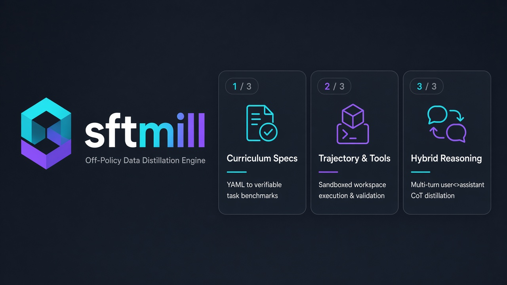

<p align="center">
  
</p>

<p align="center">
  <strong>An easy to use off-policy synthetic data distillation engine for LLMs.</strong><br>
  Turn YAML curriculum blueprints into gold-standard task benchmarks, and mill verifiable reasoning traces and multi-turn agent trajectories from any model with an OpenAI-compatible endpoint.
</p>

<p align="center">
  <a href="https://github.com/jackjusko/sftmill/actions/workflows/ci.yml"></a>
  <a href="LICENSE"></a>
  <a href="pyproject.toml"></a>
  
  
  <a href="CONTRIBUTING.md"></a>
</p>

---

## 📑 Table of Contents

- [Overview](#-overview)
- [Why sftmill?](#-why-sftmill)
- [Architecture & Two-Stage Pipeline](#-architecture--two-stage-pipeline)
- [Quickstart in 60 Seconds](#-quickstart-in-60-seconds)
- [Multi-Turn Hybrid-Reasoning (`user <> assistant`)](#-multi-turn-hybrid-reasoning-user--assistant)
- [Verifiable Agent Trajectories & Sandboxed Tools](#-verifiable-agent-trajectories--sandboxed-tools)
- [Declarative Curriculum Blueprints](#-declarative-curriculum-blueprints)
- [Writing a curriculum](docs/writing_curricula.md)
- [Multi-Harness Envelopes & Leak-Free Splitting](#-multi-harness-envelopes--leak-free-splitting)
- [CLI Reference](#-cli-reference)
- [Python API Reference](#-python-api-reference)
- [Repository Structure](#-repository-structure)
- [Comprehensive Documentation](#-comprehensive-documentation)
- [License](#-license)

---

## 🌟 Overview

**`sftmill`** is a high-throughput, modular data engine designed to generate custom Supervised Fine-Tuning (SFT) datasets through off-policy model distillation. Instead of relying on expensive human annotations or brittle web scrapers, `sftmill` allows researchers and engineers to define high-level educational curricula in declarative YAML and distill rich training corpora directly from any frontier or open-weights teacher model (such as DeepSeek-R1, Qwen 2.5, OpenAI o1/o3-mini/GPT-4o, or locally served vLLM/Ollama instances).

`sftmill` natively produces:
1. **Multi-Turn Hybrid-Reasoning Dialogues**: Multi-turn `user <> assistant` conversations capturing both latent internal chain-of-thought (`reasoning_content`) and polished conversational answers (`content`).
2. **Autonomous Tool & Agent Trajectories**: Multi-step problem solving with real bash, python, file-editing, search, and directory navigation in hermetic sandboxes.
3. **Verifiable Ground-Truth Code Fixes**: Tasks verified against unit tests (`verify: python3 check.py`) and exact post-edit filesystem states (`expect_files`).

---

## ⚡ Why sftmill?

| Feature | Typical Synthetic Data Scripts | `sftmill` Data Mill |
|---|---|---|
| **Pipeline Model** | One-off messy scripts with prompt leaks | Decoupled 2-stage architecture: Spec ➔ Benchmark ➔ Rollout |
| **Reasoning Distillation** | Flattened text or stripped thinking | **Native Hybrid Reasoning**: preserves `reasoning_content` across turns |
| **Tool Execution** | Mocked regex or unexecuted hallucinations | **Real hermetic sandbox**: isolated subshells, timeouts, path protection |
| **Verification** | Blind trust in LLM output | Deterministic grading (`exact`, `contains`, `check.py`, gold file trees) |
| **Tool Format Lock-in** | Hardcoded to one provider | Multi-harness translation: OpenAI, Claude Code XML, Alice, custom |
| **Evaluation Leakage** | Contaminated test splits | **Group Hashing**: sibling harnesses never cross train/val splits |
| **Production Scale** | Memory-heavy arrays | Auto-partitioned sharded JSONL (`part-000000.jsonl`) with live streaming |

---

## 🏗 Architecture & Two-Stage Pipeline

```text
 ┌────────────────────────────────────────────────────────┐
 │               YAML Curriculum Blueprint                │
 │    Define skills, counts, templates, and match rules   │
 └───────────────────────────┬────────────────────────────┘
                             │
                             ▼  Stage 1: sftmill tasks
 ┌────────────────────────────────────────────────────────┐
 │               Task Benchmark Synthesis                 │
 │  Synthesis teacher invents diverse questions, tests,   │
 │        seed files, and multi-turn user prompts         │
 └───────────────────────────┬────────────────────────────┘
                             │  Output: tasks.jsonl
                             ▼
 ┌────────────────────────────────────────────────────────┐
 │              Stage 2: sftmill generate                 │
 │                  Rollout & Milling                     │
 └─────────────┬────────────────────────────┬─────────────┘
               │                            │
   [kind: trace]                            [kind: trajectory]
   Multi-Turn CoT                           Sandboxed Tools
   User-Assistant Turns                     Execution Loop
               │                            │
               ▼                            ▼
   Reasoning + Answer Capture               Workspace Actions:
   (reasoning_content + content)            list_dir, read_file,
                                            edit_file, bash, python
               │                            │
               └─────────────┬──────────────┘
                             │
                             ▼
 ┌────────────────────────────────────────────────────────┐
 │                 Acceptance & Grading                   │
 │   - Exact answer match / substring contains            │
 │   - python3 check.py passes in workspace               │
 │   - expect_files tree matches gold state               │
 │   - Substantive prose verification (anti-stub filter)  │
 └───────────────────────────┬────────────────────────────┘
                             │
                             ▼
 ┌────────────────────────────────────────────────────────┐
 │              Production Sharded SFT Dataset            │
 │     data/part-000000.jsonl ... part-00000N.jsonl       │
 │            Ready for Axolotl, TRL, or Unsloth          │
 └────────────────────────────────────────────────────────┘
```

---

## 🚀 Quickstart in 60 Seconds

### 1. Installation

`sftmill` is lightweight and only requires Python 3.10+ and `pyyaml`.

```bash
# Clone the repository
git clone https://github.com/jackjusko/sftmill.git
cd sftmill

# Install in editable mode
pip install -e .

# Or using uv (recommended for ultra-fast setup)
uv pip install -e ".[dev]"
```

### 2. Synthesize Task Blueprints (Stage 1)

Use a teacher model to expand a curriculum specification into a concrete `tasks.jsonl` benchmark:

```bash
sftmill tasks \
  --curriculum configs/curriculum/code_agent_test.yaml \
  --out tasks.jsonl \
  --base-url https://api.openai.com/v1 \
  --model gpt-4o \
  --api-key $OPENAI_API_KEY \
  --jobs 4
```

Repeat `--base-url` (same `--model`) to split work across local servers. Pair `--jobs` with each URL, or pass one `--jobs` for every URL (default 3 per URL):

```bash
sftmill tasks \
  --curriculum configs/curriculum/code_agent.yaml \
  --out tasks.jsonl \
  --model qwen3.8-27b \
  --base-url http://127.0.0.1:8080/v1 --jobs 4 \
  --base-url http://127.0.0.1:8081/v1 --jobs 4
```

### 3. Mill the SFT Dataset (Stage 2)

Run generation rollouts over the synthesized tasks. Trajectories run tools in sandboxes and traces distill hybrid reasoning:

```bash
sftmill generate \
  --tasks tasks.jsonl \
  --out sft_output/ \
  --base-url https://api.deepseek.com/v1 \
  --model deepseek-reasoner \
  --api-key $DEEPSEEK_API_KEY \
  --shard-size 1000 \
  --jobs 4
```

> **Compatible with any OpenAI-style backend:** Works out of the box with **vLLM**, **Ollama**, **DeepSeek**, **Groq**, **OpenAI**, **SGLang**, or **LiteLLM**. Repeat `--base-url` for each server; `--model` is the same on every URL. Token streaming to the terminal is on only when the total number of jobs is 1.

---

## 🧠 Multi-Turn Hybrid-Reasoning (`user <> assistant`)

A core strength of `sftmill` is distilling conversational datasets where **every assistant response contains both an internal chain-of-thought scratchpad (`reasoning_content`) and user-facing conversational prose (`content`)**.

### Why Multi-Turn Hybrid Reasoning?
When training smaller models (3B, 7B, 14B, 32B), teaching the model to formulate a structured thought process before answering follow-up queries or clarifying constraints significantly elevates downstream multi-turn performance.

### 1. Curriculum YAML Setup

Set `kind: trace`, `match: open`, and `user_turns: 2` (or `3`):

```yaml
name: code_instruct
categories:
  - id: clarify_requirements
    count: 100
    kind: trace
    match: open
    user_turns: 3
    template: |
      JSON key: turns, a list of exactly 3 user messages and no assistant messages.
      The first turn is a programming task missing one critical technical constraint.
      The second turn answers with that missing constraint.
      The third turn asks for the final complete implementation and unit tests.
      No tools, no files, no answer key.
    example:
      turns:
        - "We need a rate limiter in Python for our public API endpoints."
        - "Use Redis token-bucket algorithm, limiting to 60 requests per minute per IP."
        - "Great. Please provide the complete production implementation with async redis-py."
```

### 2. How `sftmill` Generates Multi-Turn Traces

1. **Sequential Rollout**: `sftmill` feeds `turn[0]` to the teacher model.
2. **Reasoning Extraction**: The teacher's internal thinking stream (`delta.reasoning_content`) is captured separately from its visible output (`delta.content`).
3. **State Preservation**: The full dialogue history (`user` ➔ `assistant` with reasoning and text) is passed back for `turn[1]`.
4. **Anti-Stub Quality Guard**: `sftmill.generate.filters.prose_ok` automatically rejects one-word responses, lazy apologies, or stubs.

### 3. Generated Dataset Format

The resulting JSONL dataset row is ready for standard fine-tuning pipelines:

```json
{
  "kind": "trace",
  "task_id": "clarify_requirements-000042",
  "messages": [
    {
      "role": "user",
      "content": "We need a rate limiter in Python for our public API endpoints."
    },
    {
      "role": "assistant",
      "reasoning_content": "The user wants an API rate limiter in Python, but has not specified the concurrency model (FastAPI, Flask, Django), the storage backend (in-memory, Redis, Memcached), or the algorithm (token bucket, leaky bucket, sliding window). I should identify the missing details and ask for clarification.",
      "content": "I would be happy to help implement a rate limiter. To tailor it to your architecture, could you clarify:\n1. Which backend or cache you plan to use (e.g., Redis, in-memory)?\n2. Which algorithm you prefer (e.g., token bucket, sliding window log)?\n3. What are the rate limits and identifier (e.g., 60 req/min per IP)?"
    },
    {
      "role": "user",
      "content": "Use Redis token-bucket algorithm, limiting to 60 requests per minute per IP."
    },
    {
      "role": "assistant",
      "reasoning_content": "The parameters are now clear: Redis backend, token bucket algorithm, 60 req/min per IP. The user hasn't asked for code yet, so I should confirm understanding and ask if they prefer async (redis-py async) or synchronous execution.",
      "content": "Understood: Redis-backed token bucket allowing 60 requests per minute per IP. Do you need this implemented for an asynchronous framework (like FastAPI with `redis-py` async) or a WSGI application (like Flask)?"
    },
    {
      "role": "user",
      "content": "Great. Please provide the complete production implementation with async redis-py."
    },
    {
      "role": "assistant",
      "reasoning_content": "Requirements finalized: Async implementation using redis.asyncio, token bucket with capacity=60 and refill_rate=1 token/sec, atomic Lua script for concurrency safety, and a reusable dependency/middleware. Writing clean, robust code.",
      "content": "Here is a complete, production-ready asynchronous token bucket rate limiter using `redis-py` with an atomic Lua script:\n\n```python\nimport time\nfrom redis import asyncio as aioredis\n\nTOKEN_BUCKET_LUA = \"\"\"\nlocal key = KEYS[1]\nlocal capacity = tonumber(ARGV[1])\nlocal refill_rate = tonumber(ARGV[2])\nlocal now = tonumber(ARGV[3])\nlocal requested = tonumber(ARGV[4])\n...\n```"
    }
  ]
}
```

📖 *For complete fine-tuning recipes with Axolotl, Unsloth, and TRL, read the [Multi-Turn Hybrid-Reasoning Guide](docs/multi_turn_hybrid_reasoning.md).*

---

## 🛠 Verifiable Agent Trajectories & Sandboxed Tools

For agent training (`kind: trajectory`), `sftmill` executes real tool calls inside isolated temporary directory sandboxes.

### Canonical Tools Provided

- `read_file(path, offset, limit)`: Read file lines with pagination.
- `write_file(path, content)`: Create or overwrite workspace files.
- `edit_file(path, old, new)`: Precise single-occurrence string replacement.
- `search(pattern, path)`: Literal recursive search across the workspace (`path:line:text`).
- `list_dir(path)`: List directory contents.
- `bash(command)`: Execute subshell commands with sanitized environment variables.
- `python(code)`: Execute Python code with a 5-second timeout.

### Verification Guardrails

1. **Unit Test Verification (`verify: python3 check.py`)**: An automated test script is executed after the agent declares completion. If `check.py` fails or exits non-zero, the trajectory is discarded.
2. **Gold Tree Assertions (`expect_files`)**: The final workspace filesystem tree is compared against ground-truth files.
3. **Required Observations (`require_observation: PASSED`)**: Trajectories are rejected unless the agent witnessed a successful test run during its rollout.
4. **Boundary Isolation**: Path resolution ensures commands and file accesses cannot escape the sandbox root (`..` traversals are blocked).

📖 *Read the [Agent Trajectories & Tool Use Guide](docs/agent_trajectories.md) for details.*

---

## 📐 Declarative Curriculum Blueprints

A curriculum YAML is a **distribution of categories**. `sftmill tasks` synthesizes each category on its own, so grain is the category list, not the total `count`.

| Example | Role |
| --- | --- |
| [`configs/curriculum/code_agent_test.yaml`](configs/curriculum/code_agent_test.yaml) | Smoke agent mix (~32 rows). |
| [`configs/curriculum/code_agent.yaml`](configs/curriculum/code_agent.yaml) | Tool-use trajectories + graded traces; harness expansion. |
| [`configs/curriculum/code_instruct.yaml`](configs/curriculum/code_instruct.yaml) | Coding-session chat, 22×80 open traces. |
| [`configs/curriculum/general_instruct.yaml`](configs/curriculum/general_instruct.yaml) | Ordinary conversation + identity, 80 categories / 4000 tasks. |

To invent a new mix, point an LLM at those files and describe the distribution you want. **Use many narrow categories** (dozens, not a handful) or synthesis collapses to the few-shot example. Full workflow and a copy-paste authoring prompt: [Writing a curriculum](docs/writing_curricula.md). Field list: [Curriculum Specification](docs/spec.md).

```yaml
name: code_agent_benchmark
categories:
  - id: bug_fix_caching
    count: 25                     # Number of rows to synthesize
    kind: trajectory              # trace | trajectory
    match: exact                  # exact | contains | open
    max_steps: 16                 # Tool step budget per episode
    toolset: workspace            # workspace | custom
    require_observation: PASSED   # Substring that must appear in tool output
    verify: python3 check.py      # Command run in workspace to grade trajectory
    harnesses: [openai, claude_code] # Envelopes to generate
    template: |
      JSON keys: question, answer, files, expect_files.
      files includes app.py with a subtle bug, and check.py with assertions.
      The check prints PASSED only when app.py is fixed.
      expect_files contains the corrected app.py.
      answer is the single token ok.
```

### Match Modes

- **`exact`**: Graded answer must match the gold string exactly.
- **`contains`**: Expected token or needle must appear in the assistant's final response or reasoning.
- **`open`**: Open-ended conversational prose (at least two sentences). Single-turn is valid. Set `user_turns: 2` or `3` only for multi-turn dialogues.

Open traces inject [`configs/identity/alice.txt`](configs/identity/alice.txt) at **generate** unless the category sets `student_system: custom` or `off`. That identity file is a student system prompt. The harness id `alice` is a tool-call envelope, not the same thing.

📖 *See the full [Curriculum Specification Reference](docs/spec.md).*

---

## 🔀 Multi-Harness Envelopes & Leak-Free Splitting

### 1. Multi-Platform Harness Translation
The teacher generates canonical actions, and `sftmill` automatically translates them into platform-specific envelopes:
- **`openai`**: Native function-calling JSON (`{"name": "...", "arguments": {...}}`).
- **`claude_code`**: Anthropic XML blocks (`<tool_call><tool_name>...</tool_name></tool_call>`).
- **`alice`**: Jinja-delimited native envelopes (`<tool>\n...\n</tool>`).
- **`novel`**: Out-of-distribution evaluation envelopes (`[[tool]] ... [[/tool]]`).

### 2. Leak-Free Group Splitting
When a problem is expanded across multiple harnesses (e.g. `openai` and `claude_code`), both share a `group_id`. `sftmill` includes a SHA-256 partitioner ensuring all variants of a problem always land on the **same side of the train/val split**:

```python
from sftmill.dataset import iter_jsonl_dataset, split_by_group

# Load and split
all_rows = list(iter_jsonl_dataset("sft_output/"))
train_data, val_data = split_by_group(all_rows, val_fraction=0.1, seed=42)

print(f"Train rows: {len(train_data)} | Val rows: {len(val_data)}")
```

---

## 💻 CLI Reference

### `sftmill tasks`

Synthesize task definitions from a curriculum YAML file.

```bash
sftmill tasks \
  --curriculum <path/to/curriculum.yaml> \
  --out <path/to/tasks.jsonl> \
  --base-url <url> \
  --model <model_name> \
  [--api-key <key>] \
  [--temperature 0.7] \
  [--batch-size 5] \
  [--jobs 3] \
  [--progress-interval 30.0]
```

| Flag | Default | Description |
|---|---|---|
| `--curriculum` | *required* | Path to curriculum YAML spec. |
| `--out` | *required* | Destination path for synthesized tasks JSONL. |
| `--base-url` | *required* | OpenAI-compatible API root. Repeat for each server (same `--model`). |
| `--model` | *required* | Teacher model identifier (shared across every `--base-url`). |
| `--api-key` | `None` | API key (or omit for local models). |
| `--jobs` | `3` per URL | Categories in flight for the matching `--base-url`. One value applies to every URL; repeat once per URL to set each server. |
| `--batch-size` | `5` | Tasks requested per synthesis prompt. |

---

### `sftmill generate`

Execute task rollouts to produce final SFT training data.

```bash
sftmill generate \
  --tasks <path/to/tasks.jsonl> \
  --out <directory_or_file> \
  --base-url <url> \
  --model <model_name> \
  [--api-key <key>] \
  [--kind trace|trajectory|both] \
  [--temperature 1.0] \
  [--max-steps 4] \
  [--jobs 3] \
  [--shard-size 1000] \
  [--progress-interval 30.0]
```

| Flag | Default | Description |
|---|---|---|
| `--tasks` | *required* | Path to tasks JSONL file. |
| `--out` | *required* | Output path (file `.jsonl` or directory for auto-sharding). |
| `--base-url` | *required* | OpenAI-compatible API root. Repeat for each server (same `--model`). |
| `--kind` | `both` | Filter by `trace`, `trajectory`, or `both`. |
| `--max-steps` | `4` | Maximum tool-call rounds for trajectories. |
| `--jobs` | `3` per URL | Teacher calls in flight for the matching `--base-url`. One value applies to every URL; repeat once per URL to set each server. |
| `--shard-size` | `1000` | Rows per shard file (`part-000000.jsonl`) when `--out` is a directory. |
| `--progress-interval` | `30.0` | Seconds between stderr progress status lines. |

---

## 🐍 Python API Reference

```python
# 1. Stream sharded JSONL datasets
from sftmill.dataset import iter_jsonl_dataset, count_jsonl_dataset

total = count_jsonl_dataset("data/sft_output")
for row in iter_jsonl_dataset("data/sft_output"):
    print(row["task_id"], len(row["messages"]))

# 2. Thread-safe sharded writing
from sftmill.dataset import JsonlDatasetWriter

with JsonlDatasetWriter("data/output_dir", shard_size=500) as writer:
    writer.write({"messages": [...]})

# 3. Direct teacher completions
from sftmill.teachers.openai_compat import OpenAICompatibleTeacher

teacher = OpenAICompatibleTeacher(
    base_url="http://localhost:8000/v1",
    model="deepseek-ai/DeepSeek-R1-Distill-Qwen-32B",
    stream=True
)
response = teacher.complete([{"role": "user", "content": "Explain Paxos consensus."}])
print("Thoughts:", response.get("reasoning_content"))
print("Answer:", response.get("content"))
```

---

## 📂 Repository Structure

```text
sftmill/
├── assets/                       # Visual assets and banners
│   └── sftmill-banner.png
├── configs/
│   ├── curriculum/               # Ready-to-use curriculum templates
│   │   ├── code_agent.yaml       # Full agent curriculum (16 categories, tool use)
│   │   ├── code_agent_test.yaml  # Fast test curriculum (32 sample tasks)
│   │   ├── code_instruct.yaml    # Multi-turn coding-session instruct mix
│   │   └── general_instruct.yaml # Wide open instruct + identity (80 categories)
│   ├── identity/
│   │   └── alice.txt             # Default student system for open traces
│   └── tasks/
│       ├── examples.jsonl        # Minimal reference tasks
│       └── code_agent_test.jsonl # Pre-synthesized task benchmark
├── docs/                         # In-depth architectural & technical documentation
│   ├── spec.md                   # Curriculum YAML specification
│   ├── writing_curricula.md      # How to author a many-category mix
│   ├── multi_turn_hybrid_reasoning.md # In-depth guide on multi-turn CoT distillation
│   ├── agent_trajectories.md     # Sandboxing, workspace tools & verification
│   └── architecture.md           # Concurrency, data flow & system design
├── src/sftmill/
│   ├── cli.py                    # Command-line interface
│   ├── dataset.py                # Sharded writer, dataset iterator, group splitter
│   ├── harness.py                # Multi-harness envelope translation
│   ├── identity.py               # Default student system for open traces
│   ├── progress.py               # Live background status reporting
│   ├── schema.py                 # Message and tool validation
│   ├── generate/
│   │   ├── filters.py            # Exact/contains/prose acceptance filters
│   │   ├── interpret.py          # Reasoning extraction & call normalization
│   │   ├── synthesize_tasks.py   # Stage 1 synthesis engine
│   │   ├── traces.py             # Stage 2 reasoning traces & multi-turn loop
│   │   └── trajectories.py       # Stage 2 tool execution & workspace sandbox
│   ├── teachers/
│   │   └── openai_compat.py      # OpenAI-compatible streaming SSE client
│   └── tools/
│       ├── python_sandbox.py     # Isolated timeout-capped Python runner
│       └── workspace.py          # Hermetic file/bash/search workspace
├── tests/                        # Comprehensive test suite
│   ├── test_cli.py
│   ├── test_dataset.py
│   ├── test_generate.py
│   ├── test_instruct_mix.py
│   ├── test_progress.py
│   ├── test_sandbox.py
│   ├── test_synthesize_tasks.py
│   └── test_workspace_tools.py
├── pyproject.toml                # Project packaging & dependency specifications
├── CONTRIBUTING.md               # Contribution and testing guidelines
└── LICENSE                       # Apache License 2.0
```

---

## 📚 Comprehensive Documentation

- 📖 **[Curriculum Specification](docs/spec.md)**: Schema rules, category options, match modes, and synthesis shapes.
- ✍️ **[Writing a curriculum](docs/writing_curricula.md)**: Example YAMLs, LLM authoring workflow, and why you need many categories.
- 🧠 **[Multi-Turn Hybrid-Reasoning Guide](docs/multi_turn_hybrid_reasoning.md)**: Deep dive into multi-turn chain-of-thought distillation and fine-tuning recipes.
- 🛠 **[Agent Trajectories & Tool Use](docs/agent_trajectories.md)**: Sandboxed workspace tools, test execution (`check.py`), and harness envelopes.
- 🏛 **[Architecture & System Design](docs/architecture.md)**: Internal dataflow, concurrency model, and leak-free group partitioning.

---

## 🧪 Testing

`sftmill` includes a test suite covering the entire pipeline. No GPU is required:

```bash
# Run all tests
pytest

# Or via uv
uv run --with pytest pytest
```

```text
============================== 98 passed in 3.07s ==============================
```

---

## 📄 License

Copyright 2026 [Jack Jusko](https://github.com/jackjusko).

Distributed under the **Apache License, Version 2.0**. This project was originally created by Jack Jusko and is provided as-is for use in AI workflows. See [`LICENSE`](LICENSE) for the full terms.
